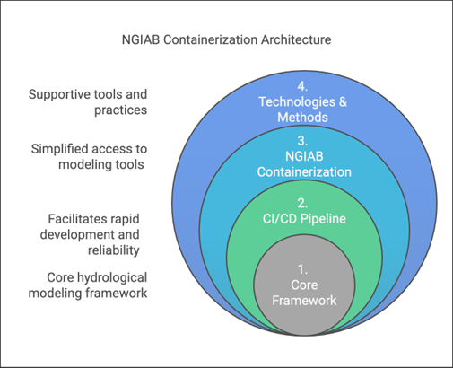
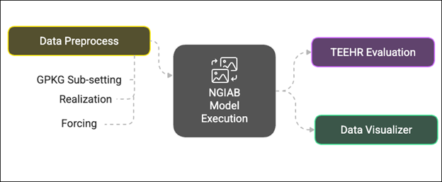

:::::::::::::::::::::::::::::::::::::: questions 

- What is the NextGen Framework?
- What is NextGen in a Box (NGIAB)?
- What is containerization?
- Why should I use NGIAB?

::::::::::::::::::::::::::::::::::::::::::::::::

::::::::::::::::::::::::::::::::::::: objectives

- Identify key components of the NGIAB architecture
- Describe NGIAB's role in the NextGen Framework
- Determine use cases for NGIAB

::::::::::::::::::::::::::::::::::::::::::::::::

## Introduction to NextGen

The U.S. National Water Model (NWM) provides hydrologic predictions for over 3.4 million miles of rivers and streams across the United States ([Cosgrove et al., 2024](https://doi.org/10.1111/1752-1688.13184)). **The Next Generation Water Resources Modeling Framework (NextGen) is an advancement of the NWM**, setting the stage for a more flexible modeling approach. NextGen promotes model interoperability and standardizes data workflows, allowing the integration of various hydrologic models tailored to specific regional processes, providing key flexibility needed for future success with continental-scale modeling. The NextGen framework continues to undergo testing, improvements, and updates through research efforts at the NOAA Cooperative Institute for Research to Operations in Hydrology (CIROH). 

## What is NGIAB?

Managing NextGen's complex software ecosystem remains challenging. The NextGen framework’s implementation requires handling numerous software libraries and dependencies, which can be a barrier for users unfamiliar with its technical requirements. To bridge this gap in accessibility of the NextGen framework for community use, we developed NextGen In A Box (NGIAB)—an open-source, containerized solution that encapsulates the NextGen framework and essential modeling components into a self-contained, reproducible application. By eliminating manual configuration burdens, NGIAB enables researchers to focus on scientific inquiry rather than software setup and maintenance. Beyond simplifying deployment of the NextGen Framework, NGIAB fosters collaboration among researchers, academic institutions, and government agencies by providing a scalable, community-driven modeling environment. **In essence, NGIAB provides a unified solution that powers NextGen models, including future versions of the NWM starting with version 4.**

## Containerization

Containerization effectively addresses compatibility issues and hardware variation challenges by **encapsulating applications, their dependencies, and runtime environments into a single, portable unit**. This ensures consistent execution across diverse computing environments, regardless of differences in hardware or software configurations. Unlike traditional virtual machines (VMs), which require separate guest operating systems and additional resource allocation, containers share the host system’s kernel, reducing overhead and improving computational efficiency. This lightweight approach allows for rapid deployment, scalability, and reproducibility, making it an ideal solution for complex scientific and engineering applications. 

NGIAB leverages Docker ([Boettiger, 2015](https://doi.org/10.1145/2723872.2723882)) and Singularity ([Hunt et al., 2005](https://www.researchgate.net/publication/236160050_An_Overview_of_the_Singularity_Project)) to streamline deployment, ensuring cross-platform compatibility, accessibility, reproducibility, and ease of use. Although Docker is a common approach for containerizing software dependencies, we also provide a Singularity option for HPC environments because it is specifically designed to integrate with existing batch job schedulers and optimize performance for HPC applications. Unlike Docker, Singularity allows users to run containers without requiring root privileges, making it more secure and better suited for multi-user HPC environments where system administrators need to maintain strict security protocols.

## Architectural Components

NGIAB is designed as a multi-layered containerized tool that encapsulates the NextGen framework and many components relevant to the NWM within a reproducible environment. 

|  |
| :--: |
| *Figure 1: Architecture of the NGIAB, highlighting its core modeling foundation, CI/CD pipelines, containerized tools and supporting technologies.* |

Figure 1 illustrates the layered architecture of NGIAB. At its core (Layer 1) lies a suite of integrated hydrological modeling components and hydrofabric, designed to work together within the NextGen framework. This core is wrapped by the CI/CD Pipeline layer (Layer 2), which leverages GitHub Actions to ensure automated testing, integration, and deployment capabilities for reproducible workflows. The NGIAB Containerization layer (Layer 3) provides the containerized environment and essential configuration tools. The outermost layer (Layer 4), Technologies & Methods, provides broader infrastructure, best practices, and support for deployment across different computing environments (local, cloud, HPC), and facilitates community engagement and contribution. **The architecture emphasizes four key aspects: core hydrological modeling framework capabilities, simplified access to modeling tools, facilitation of rapid development and reliability, and integration of supportive tools and practices.** 

## Extensions of NGIAB

Several extensions of NGIAB are already integrated with NextGen-related tools like Data Preprocess, Tools for Exploratory Evaluation in Hydrologic Research (TEEHR), and Data Visualizer (Figure 2). There is also a cloud-based system of NextGen-configured hydrologic simulations referred to as NextGen Research DataStream (Figure 3) that uses NGIAB as a core component. These extensions will be discussed in later episodes.

|  |
| :--: |
| *Figure 2: Workflow of data acquisition, model execution, evaluation, and results visualization.* |

|  |
| :--: |
| *Figure 3: NextGen Research DataStream workflow.* |

## Example Applications

Steps common to all hydrologic modeling frameworks include data collection and preparation, framework setup and model execution, evaluation, results visualization, and calibration. Researchers can use NGIAB to run simulations for their basins of interest. *Note that calibration is not yet an integrated capability within NGIAB.* Figures 4 and 5 show examples of how NGIAB and its extensions have been used to simulate streamflow for five years in the Provo River basin.

|  |
| :--: |
| *Figure 4: Map showing the drainage basin used as our demonstration case, the Provo River near Woodland, UT (Gage-10154200). This view shows the NGIAB interactive preprocessing tool. The highlighted region (light orange area; downstream-most basin in pink) represents the specific study basin, illustrating the river network (blue lines), sub-basins (orange), and surrounding USGS gaging stations (black dots).* |

|  |
| :--: |
| *Figure 5: Map showing the geospatial visualization using the Data Visualizer for a selected outlet point as well as displaying a time series plot between observed (labeled “USGS”; blue line) and simulated (labelled “ngen”; orange line) with the performance metrics (KGE, NSE, and relative bias). The Visualizer can also show the performance of the NWM 3.0 compared to the observed time series.* |

## Why should I use NGIAB?

To maximize the potential benefit of this flexible framework, **community contribution is essential**, as experts in various models and geographic areas will be needed to address the complex hydrologic challenges of continental scale operational simulation. NGIAB makes this possible in research settings by easing setup and providing easy-to-run demos, allowing hydrologists and researchers to quickly configure and modify localized water models. Its open-source framework allows hydrologists and stakeholders to easily inspect, compare, and refine model predictions. Its lightweight container size also empowers hydrologists to execute large-scale simulations efficiently and reduce computational bottlenecks. By strengthening collaboration across research teams, NGIAB will help drive the evolution of community-scale water modeling and accelerate the transition from academic innovation to real-world operational use.

## Your Turn

Here are some self-assessment questions for discussion or consideration:

- Do I understand how NGIAB fits into the NextGen Framework?
- What are the key design features and extensions of NGIAB?
- How can I use NGIAB to answer my research questions?
- How can I use NGIAB to contribute my expertise to the NextGen Framework?
  
::::::::::::::::::::::::::::::::::::: keypoints 

- The Next Generation Water Resources Modeling Framework (NextGen) advances the National Water Model with flexible, modular, and regionally adaptive hydrologic modeling at national scale.
- NextGen In A Box (NGIAB) packages the complex NextGen system into an open-source, containerized application for easier access and usability.
- NGIAB uses Docker and Singularity for portability across local machines, cloud platforms, and HPC systems.
- NGIAB's multi-layered architecture integrates hydrologic modeling tools, CI/CD pipelines, and supportive technologies and is complemented by a suite of extensions that allow for end-to-end workflows from data acquisition to visualization and evaluation.
- NGIAB fosters an open ecosystem where researchers, developers, and practitioners actively contribute new models, extensions, and workflows.

::::::::::::::::::::::::::::::::::::::::::::::::

[r-markdown]: https://rmarkdown.rstudio.com/
