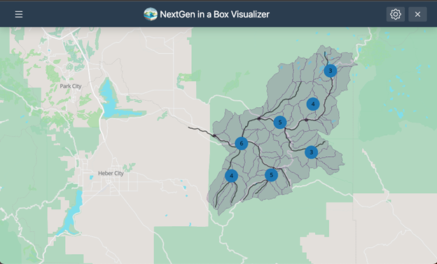

:::::::::::::::::::::::::::::::::::::: questions 

- How do I visualize my NextGen runs?

::::::::::::::::::::::::::::::::::::::::::::::::

::::::::::::::::::::::::::::::::::::: objectives

- Explain how the Data Visualizer complements NGIAB.
- Use the Data Visualizer to visualize results of a NextGen run in NGIAB.

::::::::::::::::::::::::::::::::::::::::::::::::

## Data Visualizer

The Data Visualizer component developed using the Tethys Platform [(Swain et al., 2015)](https://doi.org/10.1016/j.envsoft.2015.01.014) complements NGIAB by providing an environment for **geospatial and time series visualization of catchments and nexus points** (locations where objects in the hydrofabric like streams or water bodies connect). Through a web-based architecture, researchers can explore hydrological data in a spatiotemporal context [(CIROH, 2025)](https://github.com/CIROH-UA/ngiab-client). In addition to standard map-based displays, this component also **supports the visualization of the TEEHR output**, including tabular metrics and interactive time series plots.

### Using the Data Visualizer with NGIAB

Like TEEHR, the Data Visualizer can be activated upon execution of the main NGIAB guide script, `guide.sh`. A separate `viewOnTethys.sh` script is also available in the NGIAB-CloudInfra repository.

Once a run is complete, users can launch the Data Visualizer through their web browser when prompted by the guide script. Although TEEHR’s outputs can be displayed within the Data Visualizer, this tool is primarily designed to provide a broad overview of model results. Users seeking TEEHR’s more advanced analysis features can still access them outside the Data Visualizer.

Figures 1 and 2 demonstrate several ways the Data Visualizer can be used to visualize model outputs, including geopatial visualization for nexus points, catchment-based visualization, and TEEHR time series representation (hydrographs).

{alt='A screenshot of the NextGen in a Box Visualizer web interface. The map displays a the Provo River basin network near Woodland, UT. The gray shaded area represents the basin, dark gray lines represent catchment boundaries, black lines represent major streams, and blue circles with numbers in the middle represent the number of nexus points near that circle.'}

{alt='A screenshot of the NextGen in a Box Visualizer web interface. The left panel contains a "Time Series Menu" where the user can select a Nexus ID, variable (e.g., flow), and TEEHR data source. A map in the center displays a stream reach with a highlighted section representing the drainage basin and a blue point, indicating the selected nexus location. Below the map, a time series plot compares USGS (blue line) and Ngen (orange line) streamflow data from 2017 to 2023. On the lower left, a table labeled "Teehr Metrics" presents performance metrics (e.g., Kling-Gupta Efficiency, Nash-Sutcliffe Efficiency, and Relative Bias) for the selected model versus reference data.'}

::::::::::::::::::::::::::::::::::::: callout

## Using Data Visualizer with SSH

To use the Data Visualizer through an Secure Shell (SSH) connection, you will have to set up port forwarding when connecting to the remote machine. Port forwarding will allow you to access a remotely hosted browser session on your local machine. See the instructions under "Using NGIAB through an SSH connection" in the [Advanced Topics episode](/training-NGIAB-101/advanced-topics.html) in this training module. 

::::::::::::::::::::::::::::::::::::::::::::::::

## Your Turn

Go ahead and run the Data Visualizer in the guide script, open it in your browser, and explore the visualization of your NextGen run in NGIAB.

::::::::::::::::::::::::::::::::::::: keypoints 

- The Data Visualizer, built on the Tethys Platform, provides interactive geospatial and time series visualization for NextGen model outputs in NGIAB.
- It complements NGIAB by offering a web-based environment to explore catchments, nexus points, temporal patterns, and TEEHR outputs in your run results.
- The Data Visualizer runs automatically with the `guide.sh` script.

::::::::::::::::::::::::::::::::::::::::::::::::

[r-markdown]: https://rmarkdown.rstudio.com/
